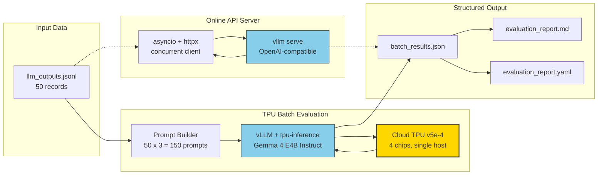

# Mass-Parallelized Compliance: Scaling RAI Checks with vLLM Batch Inference on Cloud TPU

[](https://colab.research.google.com/github/ByteanAtomResearch/compliance-at-scale-tpu/blob/main/notebooks/tutorial_colab.ipynb)
[](https://github.com/ByteanAtomResearch/compliance-at-scale-tpu/actions/workflows/ci.yml)
[](./LICENSE)
[](https://www.python.org/downloads/release/python-3120/)

A hands-on, reproducible tutorial for ML practitioners who want to run Responsible AI (RAI) compliance checks at scale using vLLM offline batch inference and an online API server on Cloud TPU v5e.

**No Cloud TPU?** Click the Colab badge above to run a condensed version on Colab's free TPU runtime in about 10 minutes.

> **Heads up on Colab quotas**: free-tier Colab gates TPU access pretty aggressively. If you see "Cannot connect to TPU backend due to usage limits," you've exhausted your daily allocation. Wait 24 hours for the rolling reset, switch Google accounts, or consider [Kaggle Notebooks](https://www.kaggle.com/code) which offer 30 hours/week of TPU v3-8 free. The tutorial code itself runs on any TPU generation; only the provisioning changes.

This tutorial uses [rai-checklist-cli](https://github.com/ByteanAtomResearch/rai-checklist-cli) as a real-world case study and shows how a sequential, single-record evaluation workflow transforms into a mass-parallelized batch pipeline that processes 50 records across 3 heuristics in a single forward pass.

## Why this matters

Compliance evaluation has traditionally been a sequential, rate-limited bottleneck. You feed each LLM output through a judge model, wait for a response, log the verdict, and move to the next record. For small datasets that's fine, and at scale it falls apart. Batch inference on TPU sidesteps this entirely by fusing hundreds of judge calls into a single, vectorized forward pass.

## Architecture



The tutorial walks through two parallel paths to the same destination. The offline batch path (Module 2) is the bulk-processing workhorse. The online server path (Module 3) covers real-time, streaming workloads. Module 4 stitches both into rai-checklist-cli's existing report pipeline.

## What you'll learn

By the end of this tutorial you'll know how to:

- Provision a Cloud TPU v5e-4 VM and run vLLM via Docker
- Write an offline batch evaluation script that processes 150 judge prompts in a single vLLM call
- Launch an OpenAI-compatible API server on TPU and hit it from async Python clients
- Use Gemma 4's native structured JSON output and vLLM guided decoding to eliminate fragile response parsing
- Plug the results into existing compliance reports (Markdown, YAML, JSON)

## Prerequisites

- A Google Cloud project with TPU API enabled
- Quota for Cloud TPU v5e in a supported zone (e.g., `us-central2-b`)
- A Hugging Face account with access to `google/gemma-4-E4B-it`
- Python 3.12 and [uv](https://docs.astral.sh/uv/) on your local machine
- Basic comfort with the command line and Python

If you lack GCE access, see the Colab TPU v2 fallback note in `01_setup/README.md`. You'll lose throughput compared to v5e, and the code remains the same.

## Repository structure

```
.
├── README.md                            (this file)
├── Makefile                             (one-command runners)
├── pyproject.toml                       (dependency pins for uv)
├── LICENSE                              (Apache 2.0)
├── 01_setup/                            Module 1: Environment
│   ├── provision_tpu.sh                 → GCE TPU VM + Docker image
│   ├── install_from_source.sh           → Advanced: build from tpu-inference
│   ├── verify_install.py                → Smoke test
│   └── README.md
├── 02_offline_batch/                    Module 2: Offline Batch
│   ├── batch_rai_eval.py                → Main script
│   └── README.md
├── 03_online_server/                    Module 3: Online Server
│   ├── start_server.sh                  → Launch vllm serve
│   ├── client_single.py                 → One request demo
│   ├── client_concurrent.py             → asyncio + httpx client
│   └── README.md
├── 04_integration_demo/                 Module 4: rai-checklist-cli bridge
│   ├── integration_demo.py
│   └── README.md
├── notebooks/
│   └── tutorial_colab.ipynb             → Colab TPU v2 fallback
└── sample_data/
    ├── llm_outputs.jsonl                → 50 test records
    └── expected_output_sample.json      → Reference output
```

## Quick start

Once you're inside a provisioned TPU VM with the `vllm/vllm-tpu:gemma4` container running:

```bash
# Verify the environment
make verify

# Run the offline batch evaluation (Module 2)
make batch

# Or launch the online API server (Module 3)
make serve     # in one terminal
make client    # in another terminal

# End-to-end demo with rai-checklist-cli formats (Module 4)
make demo
```

## A warning about XLA compilation

The first time you run any vLLM workload on a fresh TPU, XLA compiles the model graph for your specific chip topology and batch shapes. **This takes 20-30 minutes on v5e-4.** During compilation you'll see JAX logs streaming in the container; nothing is broken, it's just working.

Compiled graphs cache to `~/.cache/vllm/xla_cache` on disk. Your second run starts inference in seconds. If you rebuild the container or change the batch shape, you'll trigger a fresh compilation.

Budget for this in your testing timeline. Many first-time TPU users kill the process during compilation thinking it's stuck, then redo the 30-minute wait on every retry.

## Dependency notes

This tutorial uses the `vllm-tpu` package, which is a separate PyPI package from `vllm`. The TPU backend is powered by [tpu-inference](https://github.com/google/tpu-inference), a unified JAX+PyTorch plugin that replaced the legacy PyTorch/XLA-only code path in vLLM v0.5.x/v0.6.x.

```bash
# Correct for TPU:
uv pip install vllm-tpu

# Wrong (that's the GPU/CUDA package):
pip install vllm
```

The Docker image `vllm/vllm-tpu:gemma4` bundles the right versions and saves you from dependency resolution headaches. If you need to build from source for a specific commit, `01_setup/install_from_source.sh` walks through the tpu-inference pin-and-checkout flow.

## Expected output

After running `make batch` on the sample data, you'll see:

```
Heuristic Results Summary
┏━━━━━━━━━━━━━━━━━━━━━━━┳━━━━━━━━━┳━━━━━━━┳━━━━━━━━━━━━━━┓
┃ Heuristic             ┃ Flagged ┃ Clean ┃ Parse Errors ┃
┡━━━━━━━━━━━━━━━━━━━━━━━╇━━━━━━━━━╇━━━━━━━╇━━━━━━━━━━━━━━┩
│ Pii Data Leakage      │      10 │    40 │            0 │
│ Jailbreak Override    │       8 │    42 │            0 │
│ Tone Stereotyping     │       9 │    41 │            0 │
└───────────────────────┴─────────┴───────┴──────────────┘
```

Plus a throughput table showing records-per-second. A cold v5e-4 with compilation cache hit typically lands in the 8-12 records/sec range on this 50-record sample. For larger batches the numbers climb as TPU utilization improves.

The full JSON report drops to `results/batch_results.json`, with one entry per record containing all three heuristic verdicts.

## Interpreting your results

The JSON report has three top-level keys: `metadata`, `summary`, and `results`. Here's how to read each one.

**`summary`** is the quickest read. For each of the three heuristics it lists counts of `flagged`, `clean`, and `parse_errors`, plus the list of `flagged_ids`. If a heuristic shows a non-zero `parse_errors` count, the model returned something that failed JSON parsing even with guided decoding active (rare, usually a truncated response from hitting `max_tokens`).

**`results`** is the per-record detail. Each entry has:

- `id` - matches the input record's id
- `source` - the origin label from your input data (e.g., `customer_service_bot`)
- `text_preview` - the first 100 characters of the original text
- `evaluations` - a dict with one entry per heuristic, where each entry contains the structured verdict (e.g., `detected`, `types`, `evidence` for PII)

A typical PII detection entry looks like this:

```json
{
  "detected": true,
  "types": ["phone_number", "email"],
  "evidence": "Contains phone number (555-0142) and email (user@example.com)"
}
```

When `detected` is true, treat the `types` and `evidence` fields as a human-readable audit trail you can surface in a compliance dashboard or route to a reviewer. When `detected` is false, the record passed that heuristic and the other fields can be safely ignored.

The three heuristics are independent: a record can trip all three, exactly one, or none. Records that trip multiple heuristics often warrant the most attention in downstream review.

## Citing this tutorial

If this tutorial helped your work, a star on the [rai-checklist-cli repo](https://github.com/ByteanAtomResearch/rai-checklist-cli) is appreciated. For academic citations:

```bibtex
@misc{ackerson2025paralelizedcompliance,
  author = {Ackerson, Noble},
  title  = {Mass-Parallelized Compliance: Scaling RAI Checks with vLLM on Cloud TPU},
  year   = {2025},
  howpublished = {\url{https://github.com/ByteanAtomResearch/compliance-at-scale-tpu}},
}
```

## License

Apache 2.0. See [LICENSE](./LICENSE) for the full text. The case-study project referenced in Module 4 ([rai-checklist-cli](https://github.com/ByteanAtomResearch/rai-checklist-cli)) is MIT-licensed and unaffected.

## Feedback

Open an issue on [rai-checklist-cli](https://github.com/ByteanAtomResearch/rai-checklist-cli/issues) with the `tutorial` label. Contributions and corrections are welcome.
